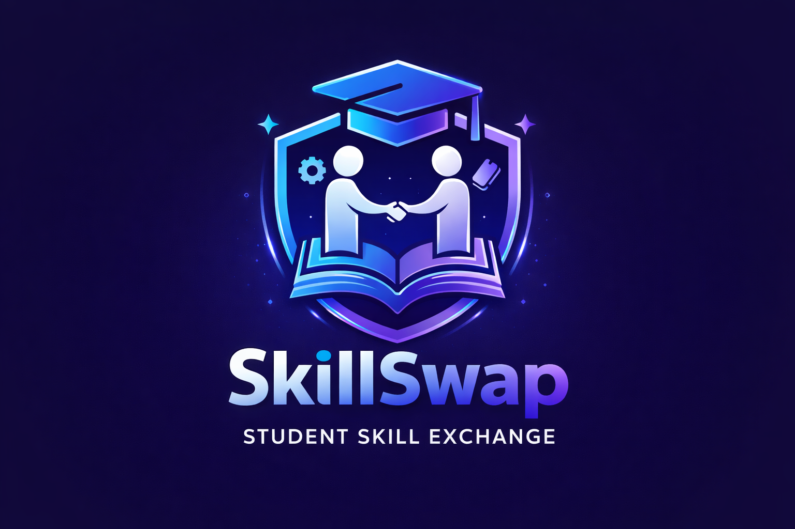

SkillSwap — Student Skill Exchange Platform 🎓
> **Pakistan Ka Pehla Student Skill Exchange Platform!**
> *Learn By Teaching — Teach By Learning*
SkillSwap is a full-featured desktop application built with Python that allows college students to exchange skills with each other — completely free, no money needed!
---
📸 Logo

---
💡 What is SkillSwap?
A peer-to-peer skill exchange platform connecting college students to share knowledge without financial barriers. Students can offer skills they know and request skills they want to learn — and exchange them with each other for free.
---
✨ Features
🔐 Authentication System
Secure User Registration with username, city & password
Login system with password validation
Terms & Services agreement screen before accessing platform
All user data stored in Excel database
🏠 Home Dashboard
Personalized welcome screen
Quick overview of platform features
👤 Profile Page
View personal info (name, city, ratings)
See your teaching & learning skills in one place
🎯 Smart Skill Matching
Add skills from 7 categories with checkboxes:
💻 Computer (Python, JAVA, PHP, React, HTML/CSS, etc.)
🍳 Cooking (Biryani, Baking, BBQ, etc.)
🎨 Arts (Drawing, Painting, Calligraphy, etc.)
🎵 Singing (Classical, Pop, Nasheed, etc.)
🌍 Languages (English, Urdu, Arabic, French, etc.)
📖 Academic (Math, Physics, Chemistry, etc.)
💪 Fitness (Yoga, Gym, Martial Arts, etc.)
Algorithm compares your learning skills with other students' teaching skills
Shows match percentage for each student
Lists common skills between you and matched students
📬 Request System
Send exchange requests to matched students
Accept or Reject incoming requests
Prevents duplicate requests automatically
Request status tracking: Pending / Accepted / Rejected
💬 Messaging System
Chat with connected students
Messages stored with timestamps
Connection-based chat (only accepted matches can message)
📊 Stats & Analytics (Matplotlib)
Bar Chart — Most popular skills across all students
Pie Chart — Request status breakdown (Pending, Accepted, Rejected)
Charts embedded directly inside the app using `FigureCanvasTkAgg`
Dark-themed charts matching the app's UI
🔄 Update Skills
Update your teaching and learning skills anytime
Category-based checkbox interface
---
🛠️ Technologies Used
Technology	Purpose
Python	Core language
Tkinter	GUI framework — all windows & widgets
OpenPyXL	Excel-based database (students.xlsx)
Pillow (PIL)	Logo display with circular image masking
Matplotlib	Data visualization — bar & pie charts
FigureCanvasTkAgg	Embed Matplotlib charts inside Tkinter
datetime	Timestamps for messages
---
📁 Project Structure
```
skillswap-python/
│
├── auth.py           # Login, Register & main app entry point
├── main.py           # Core logic + all UI screens
├── prac.py           # Messaging module
├── students.xlsx     # Excel database (users, skills, requests, messages)
└── logo.png          # App logo
```
Database Sheets (students.xlsx)
Sheet	Columns
Sheet1	ID, Name, City, Password, Ratings, Exchanges
Skills	Student_ID, Teaching, Learning
Requests	From_ID, To_ID, Status, Common_Skills
message	From_ID, To_ID, Message, Time
---
🚀 How to Run
1. Install required libraries:
```bash
pip install openpyxl pillow matplotlib
```
2. Run the app:
```bash
python auth.py
```
---
📌 Current Status
🟡 In Progress — Core features complete. More features coming soon.
✅ Completed:
Registration & Login
Terms & Services
Skill Selection (7 categories)
Smart Matching Algorithm
Request System (Send/Accept/Reject)
Messaging System
Stats & Analytics with Matplotlib
Profile Page
Dashboard
🔄 Coming Soon:
Rating system after exchange
Notification system
Search by skill
---
👨‍💻 Developer
M. Yahya Iqbal  
Software Engineering Student — Aligarh Institute of Technology, Karachi  
📧 muhammadyahyaiqbal1@gmail.com  
🔗 LinkedIn | GitHub | Portfolio
---
> *"No money needed — Exchange skills, not cash!"* 🤝
